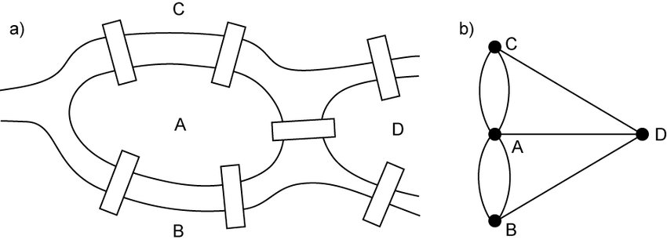

## Introduction

Graphs are useful in modeling and solving real-world problems. For example, the problem to find the least number of flights between two cities can be modeled using a graph, where the vertices represent cities and the edges represent the flights between two adjacent cities. The problem of finding the minimal number of connecting flights between two cities is reduced to finding a shortesst path between two vertices in a graph.  

The study of graph problems is known as the *graph theory*. Graph theory was founded by Leonhard Eurler in 1736, when he introduced graph terminology to solve the famous *Seven Bridges of Konigsberg* problem. The city of Konisberg, Prussia (now Kaliningrad, Russia) was divided by the Pregel River. There were two islands on the river.  The city and islands were connected by seven bridges, as shown in the diagram below. The questions is, can one take a walk, cross each bridge exactly once, and return to the startign point? Euler proved it is not possible.  



Looking at the graph we ask whether there is a path starting from any vertex, traversing all edges exactly once and returning to the starting vertex. Euler proved that for such a path to exist, each vertex must have an even number of edges. Therefore, the Seven Bridges of Konigsberg problem has no solution.   

Graph problems are often solven using algorithms. Graph algorithms have many applications in various areas such as computer science, mathematics, biology, engineering, economics, genetics, and social sciences.   

## Basic Graph Terminologies  

**Graph** - Graph is a mathematical structure that represents relationships among entities in the real world. A graph consists of nonempty set of vertices (aka nodes or points), and a set of edges that connect the vertices. For convenience, we define graph as G = (V,E) where V represents a set of vertices and E represents a set of edges.  
**Directed graph** - In a directed graph, each edge has a direction which indicates that you can ove from one vertex to the other through the edge. You can model parent child relationships using a directed graph where  an edge from A to B indicates that A is a parent of B.   
**Undirected graph** - In an undirected graph, you can move in both directions between vertices.  
**Weighted graph** - Edges of a graph may have weights that indicates a meaningful value suchs as the flight time between the two cities.  
**Unweighted graph** - Edges of a graph without weights.  
**Adjacent vertices**  
**Incident edges**  
**Degree**  
**Neighbour**  
**Loop**  
**Parallel edge**  
**Simple graph**  
**Complete graph**  
**Connected graph**  
**Subgraph**  
**Cycle**  
**Tree**  
**Spanning tree**  


## Representing Graphs  
Representing a graph is to store its vertices and edges in a program. The data structure for storing a graph is array or lists.  

### Representing Vertices  
The vertices can be stored in an array or a list. The vertices can be objects of any type. For example, you can consider cities as obkects that contain the information such as its name, population, and mayor. Thus you may define vertices as follows:-  

```
City city0 = new City("Seatle", 608660, "Mike McGinn");
...
City city11 = new City("Houston", 2099451, "Annise Parker");
City[] vertices = {city0, city1, ... , city11}
```  

### Representing Edges  
Edges of a graph can be represented using a edge objects, adjacency matrices and adjacency lists.  

**Adjaceny matrix**  

Ex:-  
```
int[][] a = {
    {0,0,1,0,0},
    {0,0,1,0,0},
    {0,0,1,0,0},
    {0,0,1,0,0}
};
```  

**Adjacency list**  
You can represent edges using adjacency vertex list or adjacency edge list. Adjacency list is defined as an array of lists.   
Ex:-  
```
//Adjaceny vertex list
java.util.List<Integer>[] neighbours = new java.util.List[12];
//neighbours[0] contains all the vertices adjacent to 0 and so on..

//Adjacency edge list using ArrayList
List<ArrayList<Edge>> neighbours = new ArrayList<>();
neighbours.add(new ArrayList<Edge>()); // for each vertex add this
neighbours.get(0).add(new Edge(0,1))
```  


**Note**  
You can represent a graph using an adjacency matrix or adjacency lists. Which one is better? If the graph is dense (i.e., there are a lot of edges), using an adjacency matrix is preferred. If the graph is very sparse(i.e, very few edges), using adjacency list is better, because using an adjacency matrix would waste a lot of space.  

## Depth First Search  

The depth first search of a graph starts from a vertex in the graph and visits all vertices in the graph as far as possible before backtracking.  
The search is called *depth-first* because it searches 'deeper' in the graph as much as possible. After visiting v, it visits an unvisited neighbour of v. If v has no unvisited neighbour, the search backtracks to the vertex from which it reached v.  

**DFS Implementation**  
DFS can be implemented using recursion or stack.

Algorithm (recursive approach):-  

```
Input: G=(V, E) and a starting vertex v
Output: a DFS tree rooted at V

Tree dfs(vertex v){
    visit v;
    for each neighbour w of v
        if(w has not been visited){
            set v as the parent for w in the tree;
            dfs(w);
        }
}
```


